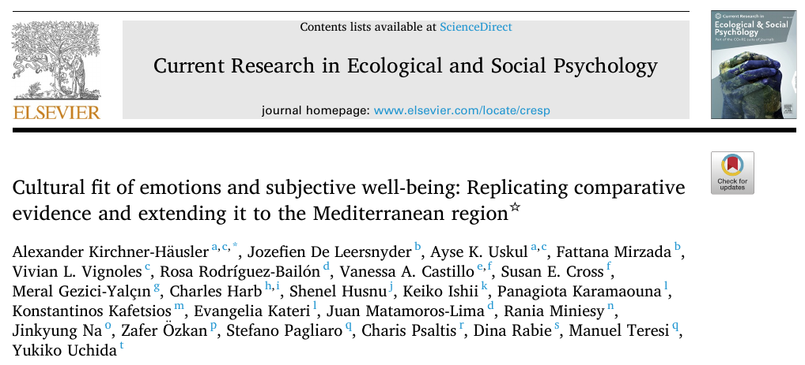
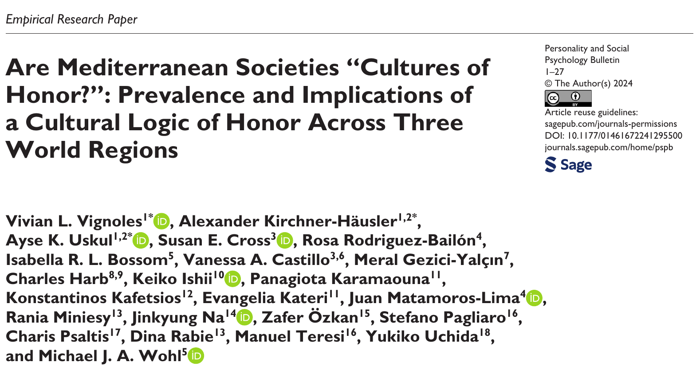
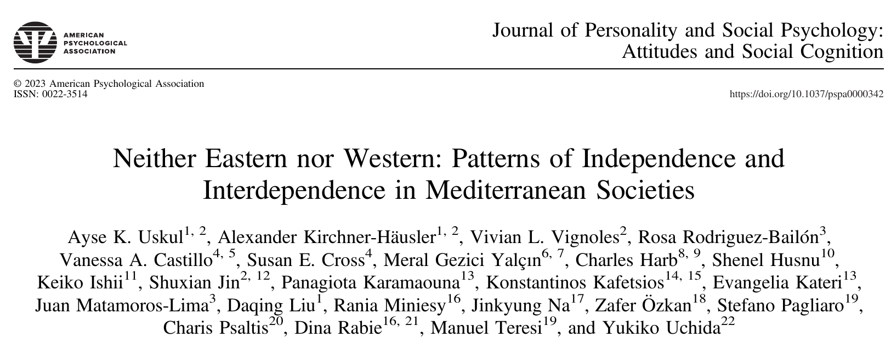
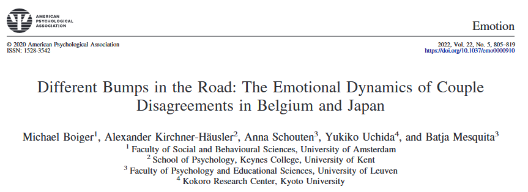
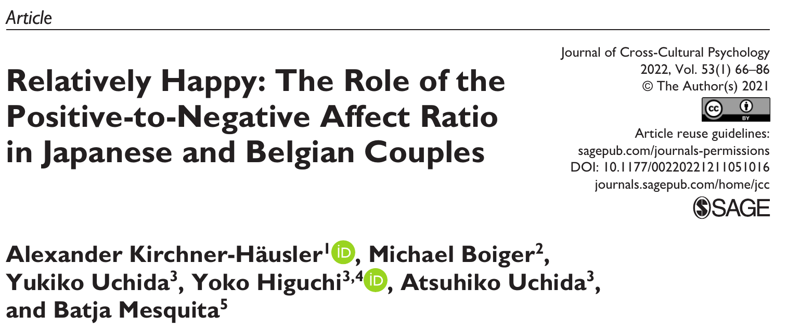

<h4 class="navigation">

[Research](index.qmd) \| [Publications](publications.qmd) \| [Presentations](presentations.qmd)

</h4>

 Hello! My name is Alexander Kirchner-Häusler and I currently am a Program-Specific Assistant Professor at the Institute for the Future of Human Society (IFOHS) at Kyoto University, as well as a affiliated researcher at the University of Sussex and KU Leuven.

A cultural psychologist by training, my research explores innovative ideas about the many ways that culture is dynamically reproduced in our relationships and interactions. I am particularly interested in three domains of research questions:

####  **Cultural Fit**

Scientific evidence over the last three decades has demonstrated that individuals’ psychological tendencies are attuned to their socio-cultural context. These culture-specific ways of being, feeling, and thinking assist individuals in navigating their cultural environment (Kitayama & Uskul, 2011). Following this reasoning, stronger alignment with one's socio-cultural environment (“cultural fit”) is generally associated with positive consequences. We have recently examined this idea by exploring links of cultural fit in emotions (Kirchner-Häusler et al., 2023) and in values (Kirchner-Häusler et al., 2024) with wellbeing in Mediterranean societies.

::::: columns
::: {.column width="47%"}
{width="50%" fig-align="right" style="border: 1px solid grey;"}
:::

::: {.column width="6%"}
:::

::: {.column width="47%"}
{width="50%" fig-align="left" style="border: 1px solid grey;"}
:::
:::::

####  **Honor & The Mediterranean**

Although anthropological work has produced early work on the cultural uniqueness of the Mediterranean (Peristiany, 1966), this region has been relatively understudied in contemporary psychological research. Honor has been established as a core value and driver of social behavior in the Mediterranean (Cross & Uskul, 2022). It has been described as “the value of a person in his own eyes, but also in the eyes of society” - as something that is not only self-defined or claimed, but also bestowed by others in terms of reputation and status. Our work responds to growing demands to make psychology a global science by studying honor and the Mediterranean across a wide range of contexts and processes, such as values (Vignoles, Kirchner-Häusler, Uskul, et al., 2024), self and relationship (Uskul, Kirchner-Häusler, et al., 2022), apologies (Kirchner-Häusler et al., under review), or transitional justice (Psaltis, Kirchner-Häusler et al., 2023).

::::: columns
::: {.column width="47%"}
{width="50%" fig-align="right" style="border: 1px solid grey;"}
:::

::: {.column width="6%"}
:::

::: {.column width="47%"}
{width="50%" fig-align="left" style="border: 1px solid grey;"}
:::
:::::

####  **Culture, Emotions, & Relationships**

Western and East-Asian cultures emphasize different ideas about how to build and maintain relationships: Relationships in Western cultures focus on individual needs, and happiness, whereas relationships in East-Asian cultures focus on relatedness and social harmony (Rothbaum et al., 2000). As a consequence, the most prominent feelings in these relationships should also vary, supporting partners in maintaining relationships in culturally appropriate ways. Previous studies have indeed shown meaningful cultural differences in the emotion norms and experiences of individuals (Miyamoto, Ma, & Wilken, 2017), but how these differences play out in actual relationships is still unclear. We aim to fill this gap by studying cultural differences in emotions in the context of romantic couples, focusing on emotional dynamics (Boiger, Kirchner-Häusler et al., 2022) and positive and negative feelings (Kirchner-Häusler et al., 2022).

::::: columns
::: {.column width="47%"}
{width="50%" fig-align="right" style="border: 1px solid grey;"}
:::

::: {.column width="6%"}
:::

::: {.column width="47%"}
{width="50%" fig-align="left" style="border: 1px solid grey;"}
:::
:::::

